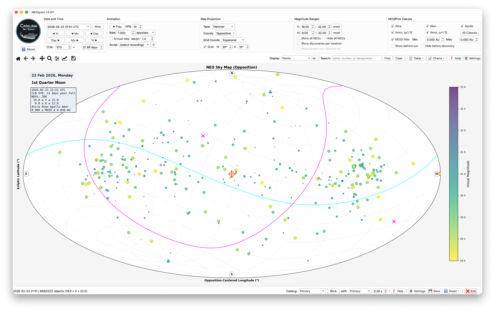

# NEOlyzer

**Near-Earth Object Visualization and Analysis** | Version 3.07

Interactive visualization tool for the NEO catalog supporting Planetary Defense research and operations. Developed at Catalina Sky Survey, University of Arizona.

- **Date Range:** 1550-2650 (DE440 ephemeris, configurable, the cached orbits are not integrated)
- **Objects:** 40,000+ Near-Earth Asteroids (catalog grows daily)

**New to NEOlyzer?** See the [Getting Started Guide](GETTING_STARTED.md) for a step-by-step walkthrough.

<a href="assets/NEOlyzer_visible_PHAs.png"></a>

*Screenshot of NEOlyzer v3.07. Controls are set for a whole-sky, ecliptic opposition, equal-area Hammer plot of Potentially Hazardous Asteroids (PHAs) visible to limiting V magnitude of 22 on February 23, 2026. The plot is overlaid with an equatorial coordinate grid. Click Settings for many other options.*

---

## Quick Start

### With Git

```bash
git clone https://github.com/rlseaman/neolyzer.git
cd neolyzer
./install.sh
./run_neolyzer.sh
```

### Without Git

Download and extract: [neolyzer-v3.07.zip](https://github.com/rlseaman/neolyzer/archive/refs/tags/v3.07.zip)

```bash
unzip neolyzer-v3.07.zip
cd neolyzer-3.07
./install.sh
./run_neolyzer.sh
```

Or download from the [Releases](https://github.com/rlseaman/neolyzer/releases) page.

**Comments, questions, suggestions?** Open an [Issue](https://github.com/rlseaman/neolyzer/issues).

---

## Platform Support

| Platform | Status |
|----------|--------|
| macOS (Intel) | Supported |
| macOS (Apple Silicon) | Supported |
| Linux (RHEL, Debian/Ubuntu) | Supported |
| Linux (Raspberry Pi) | Supported |
| Windows (via WSL) | Needs community testing |

**Requirements:**
- Python 3.10+ (3.12+ recommended)
- Unix-like shell (bash/zsh) for install scripts
- Windows users: install [WSL](https://learn.microsoft.com/en-us/windows/wsl/install) and run from a WSL terminal

Platform-specific notes in [PLATFORM_NOTES.txt](PLATFORM_NOTES.txt).

---

## Features

- **Multiple map projections:** Rectangular, Hammer, Aitoff, Mollweide
- **Coordinate systems:** Equatorial, Ecliptic, Galactic, Opposition
- **Animation:** Variable playback rate and direction
- **Moon phase display:** Catalina Lunation Number (CLN)
- **Discovery tracking:** Hide objects before discovery date, with tracklet details (rate, PA, nobs, span, site name) from bundled `NEO_discovery_tracklets.csv`
- **Earth MOID filtering:** Via JPL SBDB
- **Horizon/twilight overlays:** For observer location, with airmass limits and zenith/nadir markers
- **Scripted playback:** Full state save/restore
- **Data tables:** Selection and CSV export
- **Constellation boundaries:** IAU boundary overlay
- **Background stars:** Bright star display with magnitude filtering
- **Alternate catalogs:** Load and compare multiple catalog versions
- **Catalog blinking:** Rapidly toggle between catalogs for comparison
- **Non-discovery overlay:** Show not-yet-discovered NEOs as diamonds during lunation filter
- **Milky Way background:** Multiple sources — ESA Gaia EDR3 (color flux, density), Hipparcos density
- **Drop shadow effect:** Adaptive shadow on NEO markers for depth against background imagery
- **Configurable grid color:** Adjustable grid line color for visibility against backgrounds

---

## Launching

```bash
./run_neolyzer.sh                              # Recommended launcher
./venv/bin/python src/neolyzer.py              # Direct invocation
./venv/bin/python src/neolyzer.py --quiet      # Suppress console output
./venv/bin/python src/neolyzer.py --debug      # Enable debug logging
./venv/bin/python src/neolyzer.py --no-cache   # Skip cache, compute live
```

Exit: Click Exit button, close window, or press Ctrl+C in terminal.

---

## JPL Ephemeris Options

During setup, select which JPL planetary ephemeris to use:

| Ephemeris | Years | Size | Download | Notes |
|-----------|-------|------|----------|-------|
| DE421 | 1900-2050 | 17 MB | ~1 min | Compact, legacy |
| **DE440** | 1550-2650 | 115 MB | ~5 min | **Recommended** |
| DE441 | -13200 to +17191 | 3.5 GB | ~60 min | Extended range |

**DE440** is the default and recommended choice:
- Modern accuracy incorporating spacecraft tracking data through 2020
- Extended range covers historical observations and future predictions
- Improved lunar positions from Lunar Reconnaissance Orbiter data

**Storage requirements (approximate):**
- Ephemeris file: 17-3500 MB (stored in `~/.skyfield/`)
- Position cache: 200-400 MB (stored in `cache/`)
- Database: 50-100 MB (stored in `data/`)
- Discovery tracklets: ~4.5 MB (bundled `data/NEO_discovery_tracklets.csv`)
- Total: 300 MB - 4 GB depending on ephemeris choice

---

## Maintenance

### Basic Commands

```bash
./venv/bin/python scripts/update_catalog.py   # Update catalog from MPC
./venv/bin/python scripts/build_cache.py      # Rebuild position cache
./venv/bin/python scripts/verify_installation.py  # Verify installation
./run_setup.sh                                 # Re-run setup wizard
```

### Updating the Primary Catalog

The primary catalog can be updated from the Minor Planet Center with various options:

```bash
# Daily update (minimal, ~5 min)
./venv/bin/python scripts/update_catalog.py --fetch-moid --mark-stale --clear-cache

# Daily update with quick cache rebuild (~10 min)
./venv/bin/python scripts/update_catalog.py --fetch-moid --mark-stale --quick-cache

# Weekly update with full cache rebuild (~35 min)
./venv/bin/python scripts/update_catalog.py --fetch-moid --mark-stale --rebuild-cache

# Clean sync - delete missing objects (destructive)
./venv/bin/python scripts/update_catalog.py --fetch-moid --sync
```

**Options:**
| Option | Description |
|--------|-------------|
| `--fetch-moid` | Fetch Earth MOID values from JPL SBDB (~2-3 min) |
| `--clear-cache` | Clear position cache (app computes on-the-fly) |
| `--quick-cache` | Rebuild ±1 year high-precision cache only (~5 min) |
| `--rebuild-cache` | Rebuild entire cache - all precision tiers (~30 min) |
| `--sync` | Delete objects not in current MPC catalog (destructive) |
| `--mark-stale` | Mark missing objects as stale with timestamp |
| `--quiet` | Suppress progress output (for cron jobs) |

### Loading Alternate Catalogs

Load historical or comparison catalogs for side-by-side analysis:

```bash
# Basic load (name derived from filename)
./venv/bin/python scripts/load_alt_catalog.py alt_data/NEA_backup.txt

# Load with custom name and MOID data
./venv/bin/python scripts/load_alt_catalog.py alt_data/NEA_jan17.txt --name jan17_backup --fetch-moid

# Full load with MOID, discovery data, and position cache
./venv/bin/python scripts/load_alt_catalog.py alt_data/NEA.txt --name backup_jan \
    --fetch-moid --load-discovery --quick-cache

# Replace existing catalog
./venv/bin/python scripts/load_alt_catalog.py alt_data/NEA.txt --name backup --replace

# List loaded catalogs
./venv/bin/python scripts/load_alt_catalog.py --list

# Show catalog info
./venv/bin/python scripts/load_alt_catalog.py --info jan17_backup

# Delete a catalog
./venv/bin/python scripts/load_alt_catalog.py --delete old_catalog
```

**Options:**
| Option | Description |
|--------|-------------|
| `--name NAME` | Catalog name (default: derived from filename) |
| `--description TEXT` | Optional description for the catalog |
| `--fetch-moid` | Fetch Earth MOID values from JPL SBDB |
| `--load-discovery` | Load discovery circumstances if CSV available |
| `--build-cache` | Build full position cache for this catalog |
| `--quick-cache` | Build ±1 year high-precision cache only |
| `--replace` | Replace existing catalog with same name |
| `--list` | List all loaded alternate catalogs |
| `--info NAME` | Show detailed info about a catalog |
| `--delete NAME` | Delete an alternate catalog |
| `--force` | Force delete without confirmation |

**Using Alternate Catalogs in NEOlyzer:**
1. Select catalog from dropdown (left of Search box)
2. Click **Blink** button to toggle between primary and alternate
3. Adjust blink rate with spinner (0.25s - 5.0s)
4. Yellow background indicates alternate catalog is active
5. Some filters (MOID, discovery) disabled for alternates without that data

---

## Diagnostics

Diagnostic scripts for investigating specific issues (run from project root):

```bash
./venv/bin/python diagnose_cln.py      # Compare CLN calculation methods
./venv/bin/python diagnose_missing.py  # Check for missing NEOs in database
./venv/bin/python diagnose_sbdb.py     # JPL SBDB data diagnostics
```

---

## FAQ

**How long does installation take?**
First-time setup takes 10-40 minutes depending on internet speed and cache options. The ephemeris download (~115 MB) and cache build are the longest steps. Subsequent launches are fast.

**The display is slow or choppy during animation.**
Open Settings and enable Fast Animation mode, which decimates objects during playback. Also check [PLATFORM_NOTES.txt](PLATFORM_NOTES.txt) for platform-specific performance tips.

**How do I update the NEO catalog?**
Run `./venv/bin/python scripts/update_catalog.py --fetch-moid --mark-stale --clear-cache` for a quick daily update. See the [Maintenance](#maintenance) section for more options.

**Why are some NEOs missing from the display?**
Several filters can hide objects: magnitude limits, discovery date filter ("Hide before discovery"), behind-sun hiding, solar elongation exclusion, NEO class toggles, and declination limits. Check the Magnitude panel and Settings dialog.

**Can I go back in time before 1550?**
The default DE440 ephemeris covers 1550-2650. For earlier dates, re-run setup and select the DE441 ephemeris, which extends to 13200 BC (3.5 GB download).

**What do the colors and sizes mean?**
By default, dots are colored and sized by V magnitude (apparent brightness). Brighter objects are larger and bluer; fainter objects are smaller and redder. The color scale and size mapping are configurable in Settings.

**Installation fails with a lock file error.**
A previous install may have crashed. Run `./install.sh --force-unlock` to clear the stale lock file and try again.

**Where are ephemeris files stored?**
In `~/.skyfield/` in your home directory. These are shared across projects and not deleted when you remove NEOlyzer.

---

## Troubleshooting

| Issue | Solution |
|-------|----------|
| Python version | `brew install python@3.12` (macOS) or `apt install python3.12` |
| HDF5 errors | `brew install hdf5 && export HDF5_DIR=/opt/homebrew/opt/hdf5` |
| PyQt6 issues | See [PLATFORM_NOTES.txt](PLATFORM_NOTES.txt) |
| Permission denied | `chmod +x install.sh run_neolyzer.sh run_setup.sh` |
| Ephemeris errors | Check `~/.skyfield/` for corrupted .bsp files |
| Lock file error | `./install.sh --force-unlock` |

---

## Underlying Packages

- **[Skyfield](https://rhodesmill.org/skyfield/)** — High-precision astronomical computations
- **[JPL DE Ephemerides](https://ssd.jpl.nasa.gov/planets/eph_export.html)** — Planetary position data
- **[Minor Planet Center](https://www.minorplanetcenter.net/)** — NEO orbital elements
- **[JPL SBDB](https://ssd.jpl.nasa.gov/tools/sbdb_lookup.html)** — Physical and orbital parameters, MOID data
- **[PyQt6](https://www.riverbankcomputing.com/software/pyqt/)** — Cross-platform GUI framework
- **[Matplotlib](https://matplotlib.org/)** — Scientific visualization
- **[h5py](https://docs.h5py.org/)** — HDF5 position cache storage

## Data Credits

- **[ESA Gaia EDR3](https://sci.esa.int/web/gaia/)** — All-sky maps from 1.8 billion stars (CC BY-SA 3.0 IGO). Gaia Collaboration et al. (2021), A&A 649, A1.
- **[ESA Hipparcos](https://www.cosmos.esa.int/web/hipparcos)** — Bright star catalog (~118,218 stars). ESA (1997), The Hipparcos and Tycho Catalogues, ESA SP-1200.
---

## License

[MIT License](LICENSE) — Copyright (c) 2026 University of Arizona, Catalina Sky Survey

---

## Contact

**Rob Seaman**
Catalina Sky Survey
Lunar and Planetary Laboratory, University of Arizona
[rseaman@arizona.edu](mailto:rseaman@arizona.edu)
